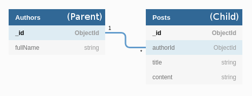

# Mongoose Reverse Populate

[](https://travis-ci.org/4umfreak/mongoose-reverse-populate)
[](https://coveralls.io/github/4umfreak/mongoose-reverse-populate?branch=master)

This module allows you to 'populate' a mongoose model (referred to as the 'model to populate') where the relationship ids are stored on another mongoose model that is related to this model (referred to as the 'related model').

For example, you have an Authors Model and a Posts Model where the Posts Model includes an authorId.



Note: An Author can have many Posts but a Post can only have one Author.

You can use a standard [`.populate()`](https://mongoosejs.com/docs/populate.html) call if you wish to query Posts and populate the Author for each. However, this method doesn't work if you want to query Authors and include all of each Author's Posts because the `ref` resides on the wrong model.

## Using the function

```
const reversePopulate = require('mongoose-reverse-populate-v2');

// Where 'Author' and 'Post' are the mongoose models for each.

Author.find().exec(function(err, authors) {
    const options = {
        modelArray: authors,
        storeWhere: "posts",
        arrayPop: true,
        mongooseModel: Post,
        idField: "author"
    };

    reversePopulate(options, function(err, popAuthors) {
        // popAuthors will be populated with posts under .posts property
    });
});
```
## Inputs

The function expects an options object and a callback to be passed into it.
```
reversePopulate(options, callback) {...}
```

#### opts

The options object should contain the following properties:

**Required properties**
* modelArray (array) - the array of Parent documents for which to fetch Children (E.g. An array of authors)
* storeWhere (string) - where on the Parent the fetched Child documents will be stored.
* arrayPop - if the Parent has many Child documents, this should be set to true. This ensures the results of the reverse populate are stored as an array (E.g. an Author has many Posts). If the Parent can only have one Child this should be set to false (e.g. a User has one Address).
* mongooseModel (object) - the mongoose model object for the Child e.g. Post
* idField (string) - the property on the Child that contains the \_id of the Parent E.g. "authorId"

**Optional properties**
* filters (object) - this allows you to pass additional "criteria" to the mongoose query that fetches Child documents. For example you might wish to exclude models that have an active property set to false E.g. `{active: {$ne: false}}`. The syntax for filters is identical to that used with mongoose `.find()` and is passed directly into the query. Note filters determines what to include and not what to exclude! See `.find` syntax [Query#find](https://mongoosejs.com/docs/api.html#query_Query-find)
* select (object / string) - restrict which fields are returned for your 'related models', see [Query#select](https://mongoosejs.com/docs/api.html#query_Query-select)
* populate (object / string) - populate your Child documents with their own children, see [Query#populate](https://mongoosejs.com/docs/api.html#query_Query-populate)
* sort (object / string) - sort your Child documents, see [Query#sort](https://mongoosejs.com/docs/api.html#query_Query-sort)
* lean (booelan) - fetch Children as raw JavaScript Objects, not mongoose documents, see [Query#lean](https://mongoosejs.com/docs/api.html#query_Query-lean)

#### callback

The callback function will be run once the objects are populated and will receive the populated modelArray as the success parameter of the function.

## Why is this needed?

You could use `.find()` to fetch all the Authors and then loop through all Authors and use another `.find()` to fetch all the Posts that include that Author's Id but this would require one query to the database for every Author that was found in the result set. Calls to the database are expensive (slow) and performance suffers.

It's much more efficient to query the Authors and then perform a single query for the Posts that include an `authorId` from the set of Authors you are looking for. The mongoose-reverse-populate-v2 module goes through both sets of data attaching Posts the their respective Authors. 

This way we can get all the data we need in only `2` database queries, rather than `1+n` queries where `n` is the number of Authors. 

## Where are the populated models?

You will notice if you perform a `console.log()` statement on your Parent documents after using `.reversePopulate()` that it appears as if Child documents were not loaded. This is because the property where the Child documnents are added is not defined in the schema and therefore filtered out in the `.toObject()` or `.toJSON()` transforms.

In the above, if you try to `console.log(popAuthors);` they will appear without a `.posts` property. However, if you loop through `popAuthors` and log the `posts` property of each author you will see the results as expected.

## Contributors

Thanks to:
* [Simon Taylor](https://github.com/s-taylor)
* [zoltanradics](https://github.com/zoltanradics)
